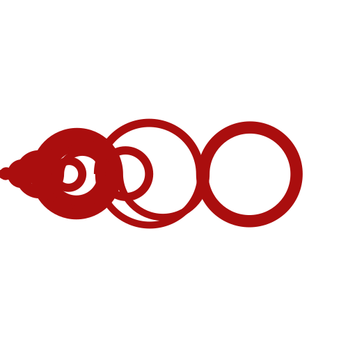

# Recamán's sequence 

I just wanted to generate pretty images



## Installation

1. It is recommended to create a virtual environment:
   ```bash
   python -m venv .venv
   ```
2. Activate the virtual environment (On Windows):
   
   ```bash
   .venv\Scripts\activate
   ```

3. Install the required dependencies:
   ```bash
   pip install -r requirements.txt
   ```

## Running the Application

1. Start the Flask application:
   ```bash
   python app.py
   ```
2. Open your web browser and go to:
   ```
   http://localhost
   ```

<!-- ## docker 

1. build 
```
docker build . -t "pd_website:v0.0.1"
```

2. run 
```
docker run pd_website:v0.0.1
``` -->


## Sources
https://scipython.com/blog/recamans-sequence/